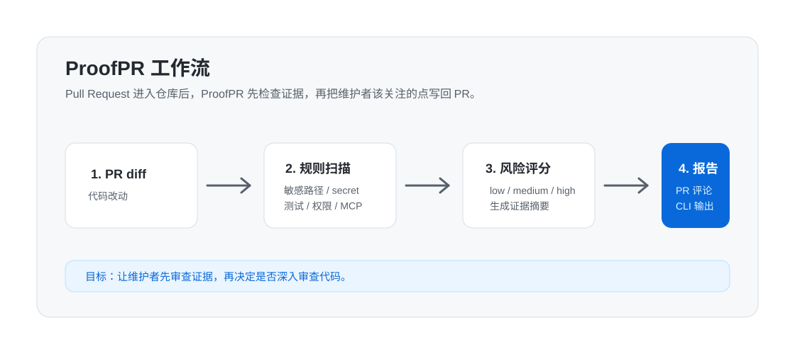

# ProofPR

[](https://github.com/linsk27/proof-pr/actions/workflows/ci.yml)
[](https://github.com/linsk27/proof-pr/releases)
[](https://www.npmjs.com/package/proof-pr)
[](LICENSE)

看证据，不看感觉。

ProofPR 是一个面向开源维护者的 **PR 证据检查器 / PR 风险扫描器**。它可以作为 GitHub Action 自动运行，在每个 Pull Request 中生成风险等级、证据评分和 Review 门禁建议，帮助维护者快速判断这个 PR 是否值得深入 review。

它不会猜代码是不是 AI 写的。它只检查一件更可靠的事：**这个贡献有没有足够的测试、复现、权限、依赖和安全证据。**

## 发布状态

- GitHub Release：[`v0.1.4`](https://github.com/linsk27/proof-pr/releases/tag/v0.1.4)
- npm：[`proof-pr@0.1.4`](https://www.npmjs.com/package/proof-pr)
- 直接运行：`npx proof-pr@latest scan --base origin/main --head HEAD --locale zh-CN`

## 真实运行截图

下面两张图来自真实运行结果，不是手绘 mock：

- PR 评论截图来自 [demo PR #1](https://github.com/linsk27/proof-pr/pull/1)，由 GitHub Action 真实生成。
- CLI 输出截图来自本机 `AI-Vue3-python-flask-Blog` 项目，使用 `npx proof-pr@latest scan --base HEAD~5 --head HEAD --locale zh-CN` 真实扫描生成。


## 适合谁

- 维护开源项目，经常收到社区 PR 的开发者。
- 担心 AI 生成 PR、低质量 PR、安全噪音占用 review 时间的维护者。
- 想在 GitHub Actions 中增加 PR 质量门禁的团队。
- 关注 secrets、CI 权限、MCP 配置、依赖风险的工程团队。

## 它解决什么问题

维护者最贵的成本不是“点开 PR”，而是花时间理解一个 PR 是否值得深入 review。尤其在 AI 辅助开发越来越普遍后，PR 可能看起来很完整，但缺少测试、复现、验证说明，或者偷偷改了 CI 权限、依赖、secret 相关文件。

ProofPR 的作用是把这些信号提前整理出来，让维护者先看证据，再决定怎么 review。它不是代码审计平台，也不替代人工 review；它更像一个 PR 进入人工 review 前的质量门禁。

## 它会检查什么

ProofPR 会扫描 PR diff 和 PR 描述，生成 `low`、`medium`、`high` 风险等级。

| 检查项 | 作用 |
| --- | --- |
| 改动规模 | 判断 PR 是否过大、是否应该拆分 |
| 敏感路径 | 标记 `.github/workflows/**`、`.env*`、`mcp*.json`、依赖文件等 |
| 测试证据 | 检查是否有测试文件变化或 PR 验证说明 |
| PR 描述 | 检查是否有复现步骤、before/after、验证信息 |
| secrets | 检测疑似 API key、token、数据库连接串 |
| 依赖变化 | 标记新增依赖或依赖清单变化 |
| CI 权限 | 标记 GitHub Actions 写权限、OIDC 权限变化 |
| MCP 风险 | 标记 MCP command、args、env、credential 风险 |

## 核心输出

ProofPR 报告不只给一个风险等级，还会给维护者一个更容易行动的结论：

- `风险等级`：`low`、`medium`、`high`，表示这个 PR 的风险强度。
- `证据评分`：`0-100`，表示这个 PR 提供的 review 证据是否充分。
- `Review 门禁`：告诉维护者下一步该正常 review、重点 review、要求补证据，还是先阻止合并。

证据评分会因为这些问题被扣分：

- PR 描述为空或过薄。
- 没有测试、截图、手动验证或 CI 说明。
- 没有复现步骤、before/after、预期/实际结果。
- PR 面积过大。
- 改动敏感路径、依赖、workflow 权限、MCP 配置。
- 疑似提交 secret 或 token。

## 三步安装到你的 GitHub 仓库

这是目前最推荐的使用方式。

### 1. 创建 workflow 文件

在你的目标仓库中创建：

```txt
.github/workflows/proofpr.yml
```

### 2. 写入下面的内容

```yaml
name: ProofPR

on:
  pull_request:
    types: [opened, synchronize, reopened]

permissions:
  contents: read
  pull-requests: write

jobs:
  proofpr:
    runs-on: ubuntu-latest
    steps:
      - uses: actions/checkout@v4
      - uses: linsk27/proof-pr@v0.1.4
        with:
          fail-on: high
          comment: "true"
```

### 3. 打开一个 PR

ProofPR 会自动运行，并在 PR 评论区生成 `ProofPR Review` 报告。

## 什么时候会自动检测？

默认 GitHub Action 只在 Pull Request 事件中运行：

- 新建分支并 `push`：不会立刻生成报告。
- 用这个分支打开 PR：会自动生成报告。
- PR 已经打开后继续 `push` 新提交：会再次检测，并更新同一条 ProofPR 评论。
- 关闭后重新打开 PR：也会重新检测。

对应的 workflow 配置是：

```yaml
on:
  pull_request:
    types: [opened, synchronize, reopened]
```

如果你只是想在本地手动检查，不需要开 PR，可以直接运行：

```bash
npx proof-pr@latest scan --base origin/main --head HEAD --locale zh-CN
```

## 在哪里看报告？

安装到 GitHub 仓库后，报告会出现在三个地方：

1. PR 页面评论区：打开 `Pull requests`，进入某个 PR，在 `Conversation` 里看 `ProofPR 审查报告`。
2. Actions 页面：进入仓库的 `Actions`，点击 `ProofPR` workflow，可以看运行日志和 job summary。
3. PR 检查状态：如果风险达到 `fail-on` 阈值，GitHub Check 会失败，用来提醒维护者合并前必须处理风险。

默认配置里 `fail-on: high` 表示只有整体风险达到 `high` 时才会让 workflow 失败。失败不代表代码一定错了，它代表这个 PR 需要维护者重点审查。

## 中文报告

如果希望 CLI 输出和 GitHub PR 评论都使用中文，在仓库根目录的 `.proofpr.yml` 中加入：

```yaml
locale: zh-CN
```

也可以只在本地命令里临时指定：

```bash
npx proof-pr@latest scan --base origin/main --head HEAD --locale zh-CN
```

如果你在 Windows PowerShell 里看到中文变成 `????` 或乱码，通常是终端编码问题，不是 ProofPR 没识别内容。建议使用 Windows Terminal / PowerShell 7，或先执行 `chcp 65001` 再运行命令。GitHub Actions 的 Ubuntu 环境默认是 UTF-8，一般不会出现这个问题。

## 可选配置

不创建配置文件也可以运行。想自定义规则时，在仓库根目录添加：

```txt
.proofpr.yml
```

示例：

```yaml
locale: zh-CN

riskThreshold: high

sensitivePaths:
  - ".github/workflows/**"
  - "**/.env*"
  - "**/mcp*.json"
  - "package.json"
  - "pnpm-lock.yaml"

requireTests:
  enabled: true
  paths:
    - "src/**"
    - "packages/**/src/**"

secrets:
  enabled: true

dependencies:
  flagNewPackages: true
  flagMajorUpgrades: true

comment:
  enabled: true
```

## 本地 CLI 使用

从 npm 直接使用：

```bash
npx proof-pr@latest init
npx proof-pr@latest scan --base origin/main --head HEAD --locale zh-CN
```

全局安装：

```bash
npm install -g proof-pr
proof-pr scan --base origin/main --head HEAD --locale zh-CN
```

从源码运行：

```bash
git clone https://github.com/linsk27/proof-pr.git
cd proof-pr
pnpm install
pnpm build
node packages/cli/dist/index.js scan --base origin/main --head HEAD --locale zh-CN
```

CLI 真实输出截图：


常用命令：

```bash
proof-pr init
proof-pr scan
proof-pr scan --base origin/main --head HEAD
proof-pr scan --base origin/main --head HEAD --locale zh-CN
proof-pr scan --base origin/main --format json
proof-pr scan --base origin/main --pr-body-file pr-body.md
proof-pr scan --base origin/main --fail-on medium
```

## 工作流示意图

这张是帮助理解流程的示意图，不是截图。



## 报告怎么看

ProofPR 报告主要看三块：

1. `Risk`：整体风险等级，可能是 `low`、`medium`、`high`。
2. `Evidence score` / `证据评分`：0-100 分，分数越高，说明 PR 越适合进入正常 review。
3. `Review gate` / `Review 门禁`：给维护者的下一步动作建议。
4. `Evidence`：文件数量、增删行数、测试文件变化、敏感文件变化、PR 描述质量。
5. `Findings`：具体风险点和维护者应该重点 review 的地方。

## 当前开发进度

当前版本：`v0.1.4`

已经完成：

- GitHub Action 自动扫描 PR。
- PR 评论报告和 GitHub job summary。
- 本地 CLI 扫描 git diff。
- Markdown、JSON、SARIF 输出。
- 中文报告输出：`.proofpr.yml` 配置 `locale: zh-CN`，或 CLI 使用 `--locale zh-CN`。
- PR title/body 证据分析。
- 改动规模、敏感路径、缺少测试、secrets、依赖、workflow 权限、MCP 配置风险规则。
- npm 包发布和 CLI 安装体验。
- GitHub Release，附带 CLI tarball。

还没完成：

- GitHub Check annotations。
- Issue 质量检查模式。
- 规则插件系统。

## 内置规则

- `change-size`：标记 review 面积过大的 PR。
- `sensitive-path`：标记 CI、依赖、secret、Docker、MCP 等敏感文件改动。
- `missing-tests`：标记没有测试文件或验证说明的代码改动。
- `thin-pr-description`：标记为空或过薄的 PR 描述。
- `missing-reproduction-context`：标记缺少复现、预期/实际行为或 before/after 说明的高风险改动。
- `secret-detected:*`：标记常见 API key、token、数据库连接串和 secret 赋值。
- `dependency-added`：标记依赖清单中的新增依赖。
- `workflow-permission-change`：标记 GitHub Actions 权限变化。
- `mcp-credential-risk`：标记 MCP command、args、env 和凭证相关风险。

## 文档

- [快速开始](docs/getting-started.md)
- [配置说明](docs/configuration.md)
- [规则说明](docs/rules.md)
- [实现原理](docs/how-it-works.md)
- [贡献指南](CONTRIBUTING.md)
- [安全政策](SECURITY.md)
- [变更记录](CHANGELOG.md)

## 搜索关键词

GitHub Action、Pull Request、PR review、PR triage、code review、maintainer tools、open source maintainer、AI coding、AI-generated PR、MCP security、secrets scanning、GitHub Actions security、dependency review、TypeScript CLI。

## 开发

```bash
pnpm install
pnpm typecheck
pnpm test
pnpm build
```

发布前检查：

```bash
pnpm release:check
```

## 路线图

- npm 发布自动化。
- GitHub Check annotations。
- SARIF 上传示例。
- Issue 复现质量检查模式。
- 规则插件系统。
- 可选 AI 摘要 provider。
- 集成 OpenSSF Scorecard 和 gitleaks。

## License

MIT
