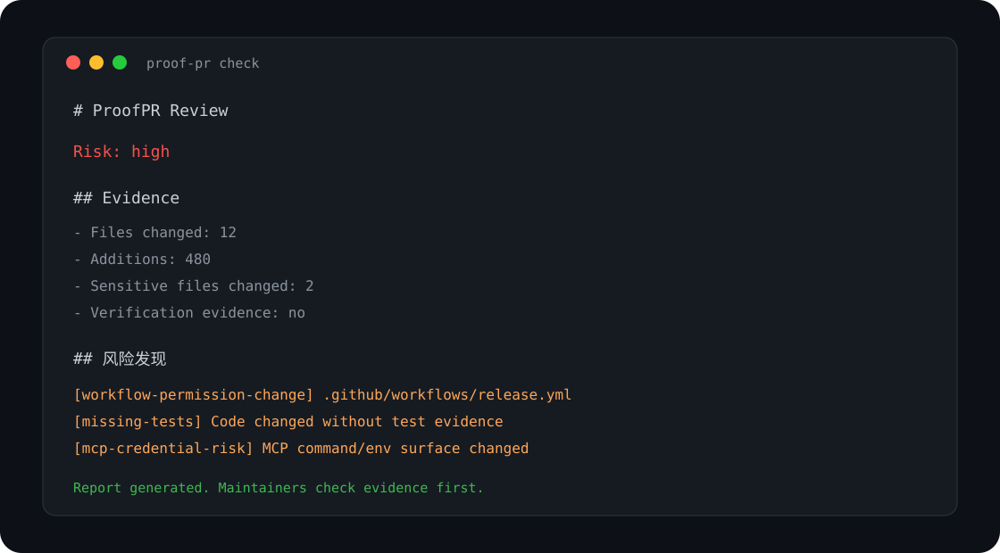

# ProofPR 文档

这里是 ProofPR 的中文文档入口。

## 新用户先看

- [快速开始](getting-started.md)：安装 GitHub Action、本地 CLI 使用方式、如何判断安装成功。
- [配置说明](configuration.md)：`.proofpr.yml` 的字段说明和示例配置。
- [规则说明](rules.md)：每条内置规则会检查什么、为什么触发。

## 效果图

PR 评论效果：

CLI 输出效果：

工作流示意：

## 当前定位

ProofPR 是一个给开源维护者使用的 PR 证据检查器。它关注的是“这个 PR 有没有足够证据值得 review”，而不是猜测“代码是不是 AI 写的”。

核心关键词：

- PR evidence scanner
- pull request review
- PR triage
- maintainer tools
- AI coding review
- MCP security
- secrets scanning
- GitHub Actions security
