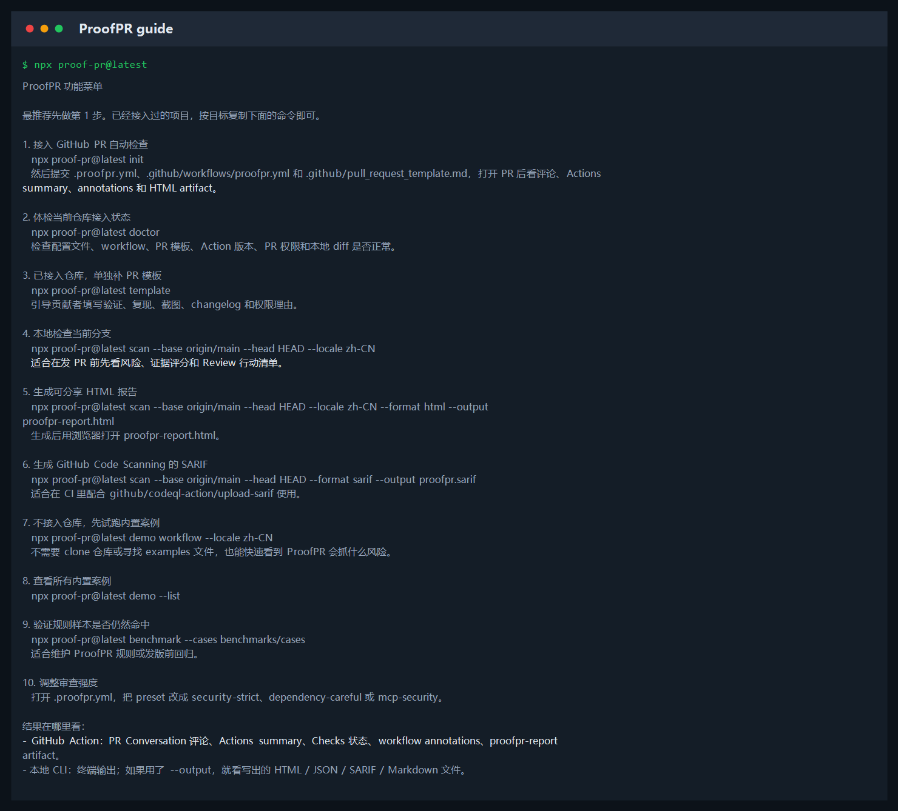
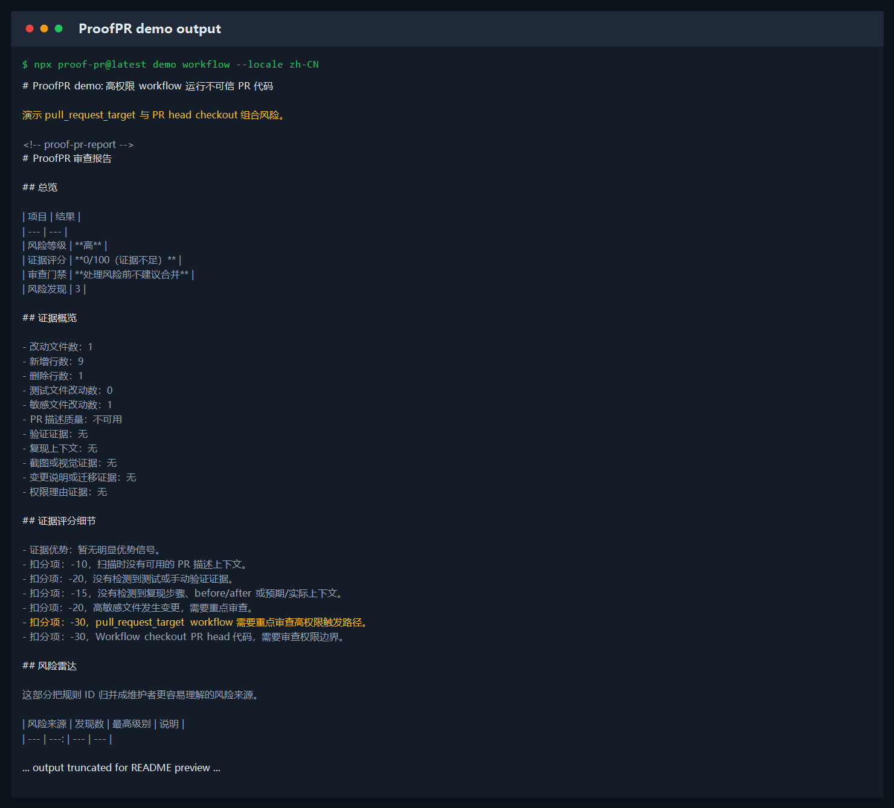
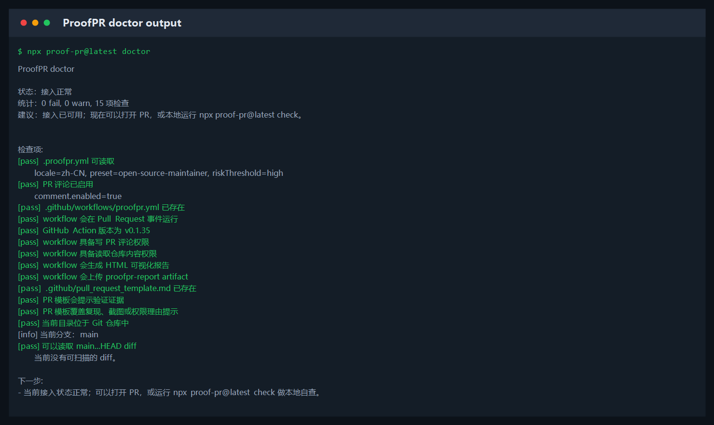

# 命令速查

ProofPR 不是通用扫描器。它是 PR 证据门禁，默认只围绕一件事工作：判断 PR 有没有足够证据，值得维护者开始 review。

如果不知道怎么开始，先运行：

```bash
npx proof-pr@latest
```

或显式打开功能菜单：

```bash
npx proof-pr@latest guide
```

也可以运行 `npx proof-pr@latest --help`。帮助信息会显示中文命令说明，底部会给出 `init`、`check`、`request` 三条常用复制命令。



## 默认路径

| 目标 | 命令 | 结果在哪里看 |
| --- | --- | --- |
| 接入 GitHub PR 自动检查 | `npx proof-pr@latest init` | PR 评论、Actions summary、Checks、HTML artifact |
| 发 PR 前本地自查 | `npx proof-pr@latest check` | 当前终端 |
| 生成贡献者补证请求 | `npx proof-pr@latest request` | 当前终端 |

## 辅助命令

| 场景 | 命令 | 结果在哪里看 |
| --- | --- | --- |
| 不确定是否装好 | `npx proof-pr@latest doctor` | 当前终端 |
| 自动修复常见接入问题 | `npx proof-pr@latest doctor --fix` | 当前终端和接入文件 |
| 先看效果，不改仓库 | `npx proof-pr@latest demo workflow --locale zh-CN` | 当前终端 |
| 已接入仓库但缺少 PR 模板 | `npx proof-pr@latest template` | `.github/pull_request_template.md` |
| 把补证请求写入文件 | `npx proof-pr@latest request --output proofpr-request.md` | `proofpr-request.md` |
| 输出完整补证模板 | `npx proof-pr@latest request --full` | 当前终端 |
| 想把报告保存成页面 | `npx proof-pr@latest check --format html --output proofpr-report.html` | `proofpr-report.html` |
| 想接入 GitHub Code Scanning | `npx proof-pr@latest check --format sarif --output proofpr.sarif` | `proofpr.sarif` / Code Scanning |
| 查看所有内置案例 | `npx proof-pr@latest demo --list` | 当前终端 |
| 维护规则或发版前回归 | `npx proof-pr@latest benchmark --cases benchmarks/cases` | 当前终端 |
| 调整审查强度 | 修改 `.proofpr.yml` 里的 `preset` | 下一次扫描报告 |

## 1. 不接入仓库，先体验报告

执行：

```bash
npx proof-pr@latest demo workflow --locale zh-CN
```



这个命令不需要你的项目里存在 `.proofpr.yml`，也不需要 clone ProofPR 仓库。它会直接运行一个内置 workflow 风险案例。

查看全部内置案例：

```bash
npx proof-pr@latest demo --list
```

常用案例：

```bash
npx proof-pr@latest demo workflow --locale zh-CN
npx proof-pr@latest demo secret --locale zh-CN
npx proof-pr@latest demo dependency --locale zh-CN
npx proof-pr@latest demo mcp --locale zh-CN
npx proof-pr@latest demo ui-evidence --locale zh-CN
```

## 2. 接入 GitHub PR 自动检查

执行：

```bash
npx proof-pr@latest init
```

它会生成：

- `.proofpr.yml`
- `.github/workflows/proofpr.yml`
- `.github/pull_request_template.md`

提交这些文件后，打开或更新 Pull Request，ProofPR 会自动运行。默认结果会出现在 PR 评论、Actions summary、workflow annotations 和 `proofpr-report` artifact。PR 模板会提醒贡献者补充验证、复现、截图、changelog 和权限理由。

这个命令可以重复执行。已有文件默认保留不覆盖；如果想把配置、workflow 和 PR 模板刷新到当前版本模板，再使用：

```bash
npx proof-pr@latest init --force
```

如果你的仓库已经接入过 ProofPR，只想单独补 PR 模板：

```bash
npx proof-pr@latest template
```

默认触发时机是：

- PR opened：第一次打开 PR。
- PR synchronize：PR 分支继续 push。
- PR reopened：关闭后重新打开。

## 3. 体检接入状态

执行：

```bash
npx proof-pr@latest doctor
```



它会检查：

- `.proofpr.yml` 是否存在并能解析。
- `.github/workflows/proofpr.yml` 是否存在。
- `.github/pull_request_template.md` 是否存在，以及是否提示验证、复现、截图或权限理由。
- workflow 是否监听 `pull_request`。
- workflow 是否使用当前推荐的 `linsk27/proof-pr@v0.1.35`。
- 是否具备 `pull-requests: write` 和 `contents: read` 权限。
- 是否启用了 `html-output` 和 `actions/upload-artifact`，方便下载 HTML 可视化报告。
- 当前目录是否在 Git 仓库里，以及自动识别出的 base...HEAD diff 是否可读。

报告顶部会给一句话建议：接入正常时提示打开 PR 或运行 `check`，存在问题时提示先运行 `doctor --fix` 或按 Next steps 处理。

`doctor` 默认会像 `check` 一样自动选择 `origin/main`、`origin/master`、`upstream/main`、`upstream/master`、`main` 或 `master`。如果你的主分支不是这些名字，可以这样指定：

```bash
npx proof-pr@latest doctor --base origin/master
```

## 4. 本地扫描当前分支

执行：

```bash
npx proof-pr@latest check
```

适合在发 PR 前自查。它会自动选择 `origin/main`、`origin/master`、`main` 或 `master` 作为 base，并扫描当前工作区相对 base 的最终状态：已提交分支 diff、staged、unstaged 和未跟踪新文件都会纳入。输出包括风险等级、证据评分、Review 门禁和行动清单。

如果当前没有可扫描 diff，`check` 会输出短提示，说明这不是错误，并提示你运行 `doctor`、`demo`，或提交改动后再检查。

如果你的主分支不是常见名字，可以显式传 base：

```bash
npx proof-pr@latest check --base origin/dev
```

## 5. 生成 HTML 可视化报告

执行：

```bash
npx proof-pr@latest check --format html --output proofpr-report.html
```

生成后，用浏览器打开 `proofpr-report.html`。这个文件适合：

- 发给同事快速看风险。
- 放进 CI artifact。
- 截图放进文档或 issue。
- 在页面里按高/中/低风险筛选，搜索规则、文件或详情。
- 一键复制“补证清单”，发给贡献者补 PR 描述。
- 查看“风险雷达”，先判断风险主要来自证据、供应链、Workflow、Secret 还是 Review 面。

## 6. 只生成贡献者补证请求

执行：

```bash
npx proof-pr@latest request
```

这个命令和 `check` 使用同一套默认 diff 逻辑，但只输出一段可以直接贴给贡献者的简短补证说明。适合维护者不想转发完整报告，只想让贡献者补充测试、复现、截图、依赖或权限理由时使用。

如果当前没有可扫描 diff，`request` 会输出短提示，说明这不是错误，并提示你运行 `doctor`、`demo ui-evidence`，或提交改动后再生成补证请求。

写入文件：

```bash
npx proof-pr@latest request --output proofpr-request.md
```

如果你需要完整补证模板：

```bash
npx proof-pr@latest request --full
```

## 7. 生成 SARIF

执行：

```bash
npx proof-pr@latest check --format sarif --output proofpr.sarif
```

SARIF 主要给 GitHub Code Scanning 或其他安全平台读取。完整接入方式见 [SARIF / Code Scanning](sarif-code-scanning.md)。

## 8. 跑内置风险案例

执行：

```bash
npx proof-pr@latest demo workflow --locale zh-CN
```

这个命令不需要修改你的项目，也不需要 examples 文件，适合快速理解 ProofPR 会如何判断 workflow、供应链依赖、secret、测试证据这些风险。依赖案例会展示大版本升级、非注册表来源、未固定版本和 lockfile 提示。

## 9. 跑 benchmark

执行：

```bash
npx proof-pr@latest benchmark --cases benchmarks/cases
```

benchmark 用来验证规则样本是否仍按预期命中。普通使用者不必每天跑它；维护 ProofPR 规则、准备发版或怀疑规则退化时再跑。

## 10. 调整审查强度

打开 `.proofpr.yml`，修改 `preset`：

```yaml
locale: zh-CN
preset: open-source-maintainer

comment:
  enabled: true
```

常用值：

| preset | 适合场景 |
| --- | --- |
| `open-source-maintainer` | 开源仓库默认推荐 |
| `security-strict` | 安全敏感项目 |
| `dependency-careful` | 特别关注依赖、lockfile 和供应链来源 |
| `mcp-security` | 特别关注 MCP / agent 配置 |
| `ai-generated-pr` | AI 生成 PR 较多的仓库 |
