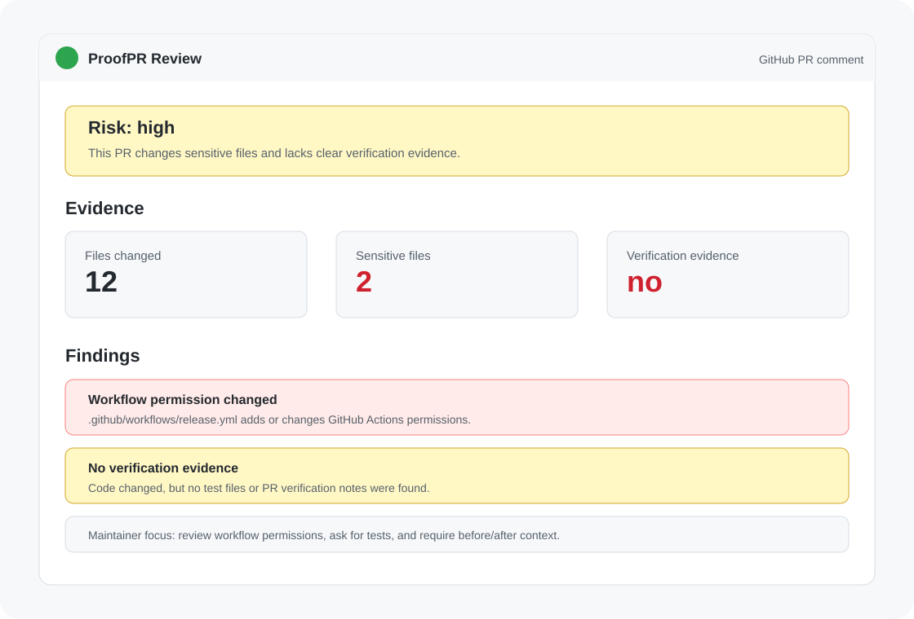

# 快速开始

这份文档只讲怎么安装和怎么跑起来。



## 你应该选哪种方式？

大多数用户应该选择 GitHub Action。

- 你想让某个 GitHub 仓库的 PR 自动生成 ProofPR 报告：使用 GitHub Action。
- 你想在本地手动扫描一个 git diff：使用 CLI。
- 你只是想参与开发 ProofPR 本身：从源码运行。

## 方式一：安装到 GitHub 仓库

在你的目标仓库中创建文件：

```txt
.github/workflows/proofpr.yml
```

写入：

```yaml
name: ProofPR

on:
  pull_request:
    types: [opened, synchronize, reopened]

permissions:
  contents: read
  pull-requests: write

jobs:
  proofpr:
    runs-on: ubuntu-latest
    steps:
      - uses: actions/checkout@v4
      - uses: linsk27/proof-pr@v0.1.0
        with:
          fail-on: high
          comment: "true"
```

提交这个文件后，打开一个 PR。ProofPR 会在 PR 中自动生成报告评论。

## 方式二：添加配置文件

配置文件不是必须的，但建议添加。

在目标仓库根目录创建：

```txt
.proofpr.yml
```

写入：

```yaml
riskThreshold: high

sensitivePaths:
  - ".github/workflows/**"
  - "**/.env*"
  - "**/mcp*.json"
  - "package.json"
  - "pnpm-lock.yaml"

requireTests:
  enabled: true
  paths:
    - "src/**"
    - "packages/**/src/**"

secrets:
  enabled: true

dependencies:
  flagNewPackages: true
  flagMajorUpgrades: true

comment:
  enabled: true
```

## 方式三：本地使用 CLI

当前 CLI 还没有发布到 npm，所以暂时不要把 `npx proof-pr` 当作主要路径。

可以从 GitHub Release 安装：

```bash
npm install -g https://github.com/linsk27/proof-pr/releases/download/v0.1.0/proof-pr-0.1.0.tgz
proof-pr scan --base origin/main --head HEAD
```

也可以从源码运行：

```bash
git clone https://github.com/linsk27/proof-pr.git
cd proof-pr
pnpm install
pnpm build
node packages/cli/dist/index.js scan --base origin/main --head HEAD
```

## 常用命令

初始化配置和 workflow：

```bash
proof-pr init
```

扫描当前工作区 diff：

```bash
proof-pr scan
```

扫描指定 base/head：

```bash
proof-pr scan --base origin/main --head HEAD
```

输出 JSON：

```bash
proof-pr scan --base origin/main --format json
```

加入 PR 描述证据检查：

```bash
proof-pr scan --base origin/main --pr-title "Fix login redirect" --pr-body-file pr-body.md
```

风险达到 medium 或 high 时让进程失败：

```bash
proof-pr scan --base origin/main --fail-on medium
```

## 怎么判断安装成功？

GitHub Action 安装成功后，你会在 PR 页面看到：

- Actions 中出现 `ProofPR` workflow。
- PR 评论区出现 `ProofPR Review`。
- 报告里有 `Risk`、`Evidence`、`Findings` 三块内容。

如果没有出现评论，先检查 workflow 权限是否包含：

```yaml
permissions:
  contents: read
  pull-requests: write
```
