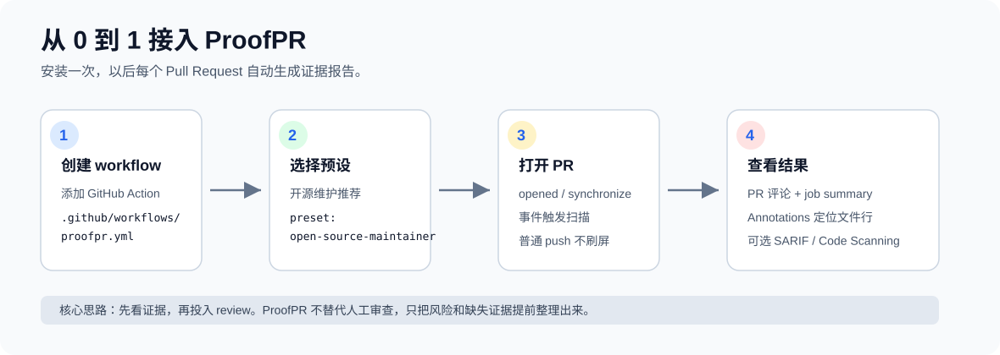
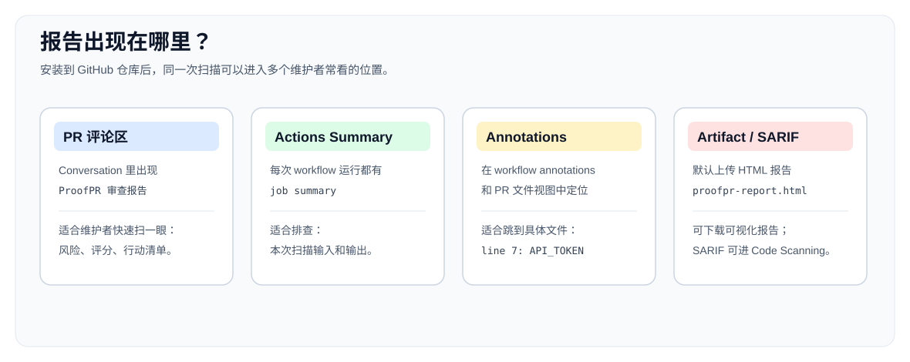
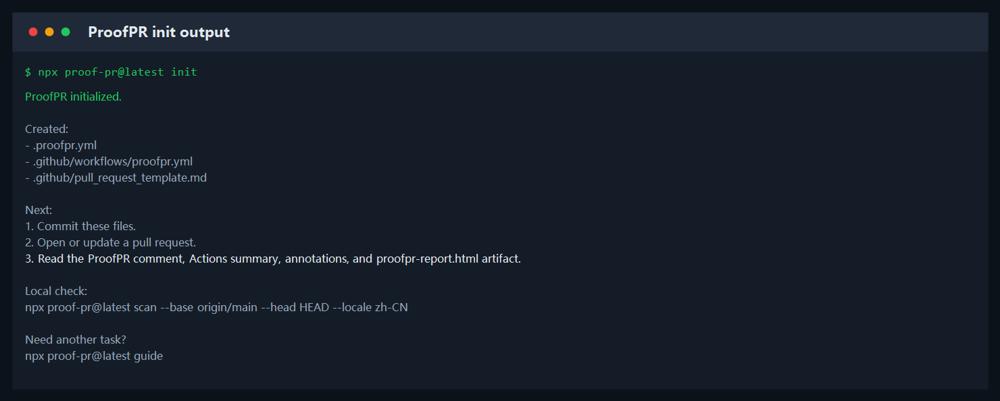
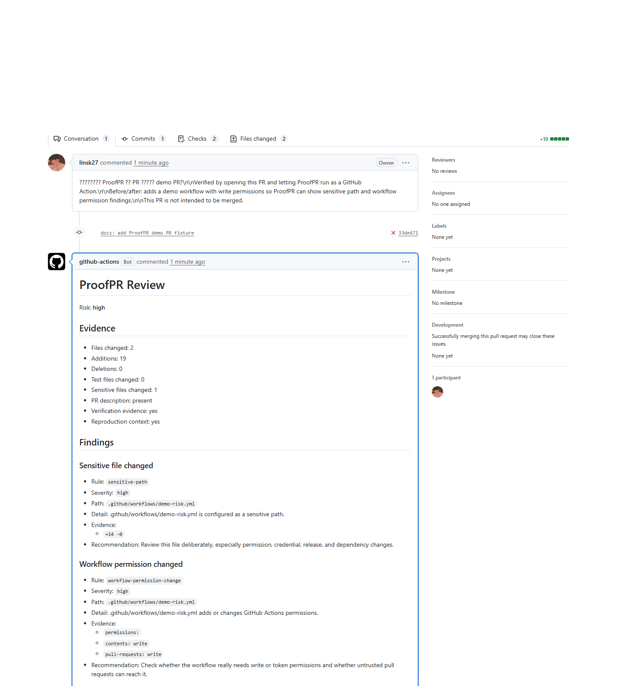
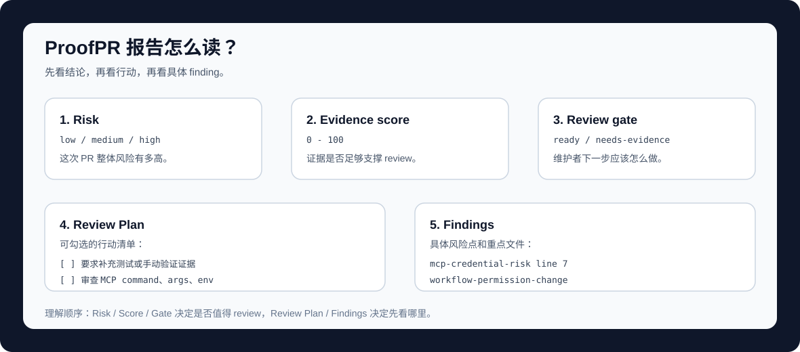
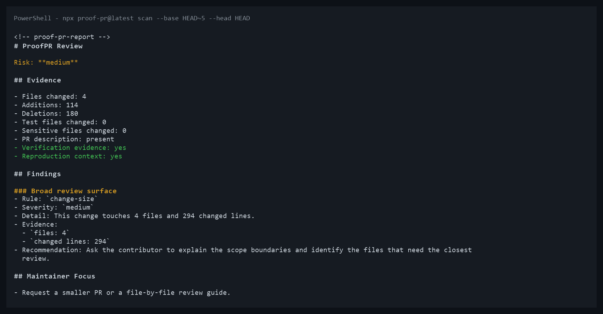
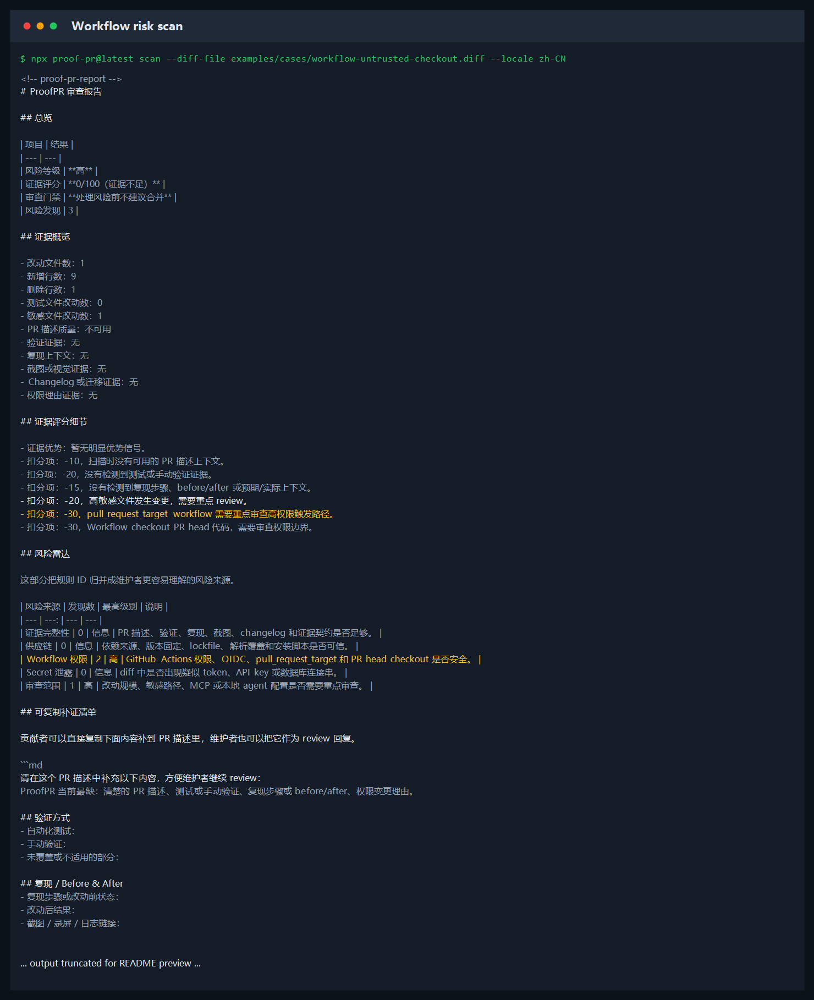
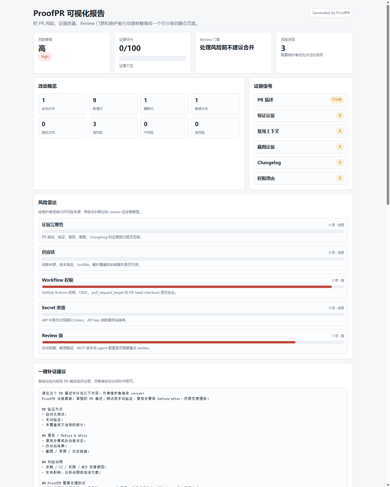
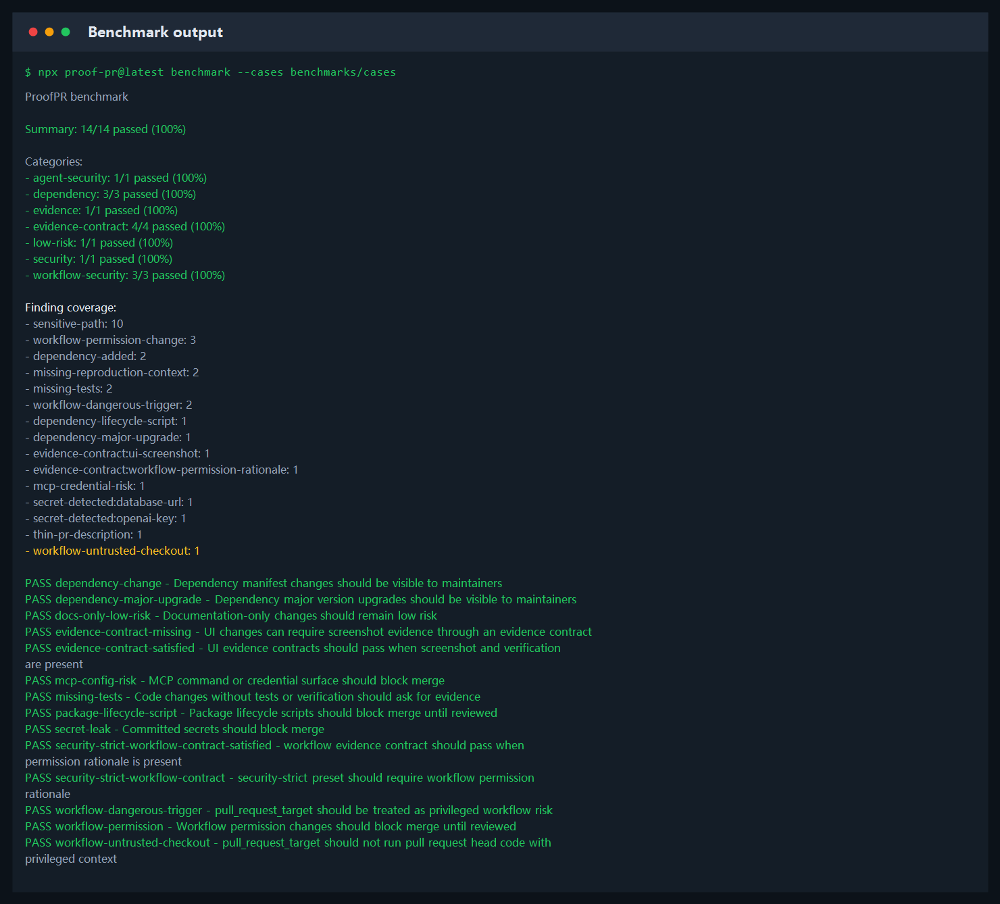

# 从 0 到 1 安装和验证 ProofPR

这份文档面向第一次使用 ProofPR 的用户。照着做完，你会知道它什么时候运行、在哪里看结果、报告每一块是什么意思。



## 第 0 步：你会得到什么

如果只是想先看效果，不想改仓库，可以先运行：

```bash
npx proof-pr@latest demo workflow --locale zh-CN
```


安装后，每个 Pull Request 会得到：

- 一条 `ProofPR 审查报告` PR 评论。
- 一份 GitHub Actions job summary。
- 一组 GitHub annotations，用来定位具体 finding。
- 一个 `proofpr-report` artifact，里面是可搜索、可筛选的 HTML 可视化报告。
- 可选的 SARIF 文件，上传到 GitHub Code Scanning。



初始化成功时，你会看到类似输出：



## 第 1 步：一条命令生成配置

```bash
npx proof-pr@latest init
```

这个命令会生成：

- `.proofpr.yml`
- `.github/workflows/proofpr.yml`
- `.github/pull_request_template.md`

默认配置已经会输出中文报告、上传 HTML 可视化报告，并使用开源维护者预设。PR 模板会引导贡献者补充验证、复现、截图、changelog 和权限理由。

如果你中途忘了某个功能怎么用，运行：

```bash
npx proof-pr@latest guide
```

它会按“接入自动检查、本地扫描、HTML 报告、SARIF、benchmark”等目标列出命令。

## 第 2 步：体检接入状态

```bash
npx proof-pr@latest doctor
```


如果看到 `状态：接入正常`，说明配置文件、workflow、PR 模板、PR 权限和本地 diff 检查都已经通过。如果有 `[warn]` 或 `[fail]`，按 `Next` 里的提示修复即可。

## 第 3 步：提交两个文件

```bash
git add .proofpr.yml .github/workflows/proofpr.yml .github/pull_request_template.md
git commit -m "chore: add ProofPR"
```

先不要急着改配置，默认已经够试用。ProofPR 只会在 PR 场景运行，不会因为普通分支 push 就刷屏。

## 第 4 步：打开一个测试 PR

你可以在测试分支里做一个很小的改动，比如修改一个源码文件但不加测试。打开 PR 后，ProofPR 会在这些事件触发：

- PR opened：首次打开。
- PR synchronize：PR 分支继续 push 新提交。
- PR reopened：关闭后重新打开。

## 第 5 步：看 PR 评论

进入 PR 的 `Conversation`，找到 `ProofPR 审查报告`。

真实 PR 评论截图：



优先看四块：



- `Risk`：整体风险。
- `Evidence score`：证据是否充分。
- `Review gate`：下一步动作建议。
- `Review Plan`：维护者 checklist。

## 第 6 步：看 Actions 和 annotations

进入仓库 `Actions`，点击 `ProofPR` workflow。

你会看到：

- job summary：完整 Markdown 报告。
- annotations：高风险 finding 会变成 GitHub 注解。
- artifact：默认名为 `proofpr-report`，下载后打开 `proofpr-report.html`，可以筛选风险、搜索文件/规则，并复制补证清单。
- 如果 finding 有行号，例如 MCP 的 `command`、`args`、`env`，annotation 会尽量定位到具体行。

## 可选：以后再调规则

如果你的项目更关注安全、依赖或 MCP，只需要把 `.proofpr.yml` 里的 `preset` 改成下面其中一个：

```yaml
preset: security-strict
```

```yaml
preset: dependency-careful
```

```yaml
preset: mcp-security
```

如果你想让仓库自己定义证据要求，可以加 Evidence Contract。比如 UI 改动必须有截图和验证说明：

```yaml
evidence:
  contracts:
    - id: ui-screenshot
      paths:
        - "src/components/**"
      requires:
        - screenshot
        - verification
      severity: medium
```

## 第 7 步：本地 CLI 试跑

不用开 PR，也可以本地扫描：

```bash
npx proof-pr@latest --version
npx proof-pr@latest scan --base origin/main --head HEAD --locale zh-CN
```

第一行当前应输出 `0.1.16`，用于确认 npm latest 已经安装正确。

扫描内置案例：

```bash
npx proof-pr@latest scan --diff-file examples/cases/missing-tests.diff --locale zh-CN
npx proof-pr@latest scan --diff-file examples/cases/mcp-config-risk.diff --locale zh-CN
npx proof-pr@latest scan --diff-file examples/cases/secret-leak.diff --locale zh-CN
```

真实 CLI 输出截图：



如果你想快速理解高风险 workflow finding，可以扫描内置案例：

```bash
npx proof-pr@latest scan --diff-file examples/cases/workflow-untrusted-checkout.diff --locale zh-CN
```



如果你想把结果保存成可分享页面，可以生成 HTML 可视化报告：

```bash
npx proof-pr@latest scan --diff-file examples/cases/workflow-untrusted-checkout.diff --locale zh-CN --format html --output proofpr-report.html
```

这个页面可以按高/中/低风险筛选、搜索规则或文件，并复制一段“补证清单”给贡献者。



验证规则样本是否仍按预期命中：

```bash
npx proof-pr@latest benchmark --cases benchmarks/cases
```



## 第 8 步：可选接入 Code Scanning

如果你想让 finding 进入 GitHub 的安全看板，可以配置 SARIF：

```yaml
permissions:
  contents: read
  pull-requests: write
  security-events: write

steps:
  - uses: actions/checkout@v4
  - uses: linsk27/proof-pr@v0.1.16
    with:
      fail-on: high
      comment: "true"
      annotations: "true"
      sarif-output: proofpr.sarif
      html-output: proofpr-report.html
  - uses: github/codeql-action/upload-sarif@v3
    with:
      sarif_file: proofpr.sarif
  - uses: actions/upload-artifact@v4
    with:
      name: proofpr-report
      path: proofpr-report.html
```

完整说明见 [SARIF / Code Scanning](sarif-code-scanning.md)。

## 安装成功的判断标准

如果下面三件事都出现了，就说明安装成功：

- PR 评论区有 `ProofPR 审查报告`。
- Actions 的 `ProofPR` workflow 成功运行。
- Actions 运行详情里有 `proofpr-report` artifact。
- 报告里有 `风险等级`、`证据评分`、`Review 门禁`、`Review 行动清单`。

如果没有评论，优先检查 workflow 权限：

```yaml
permissions:
  contents: read
  pull-requests: write
```

如果中文在 Windows PowerShell 里显示成一串问号或乱码，通常是终端编码问题。建议使用 Windows Terminal / PowerShell 7，或运行：

```powershell
chcp 65001
```
